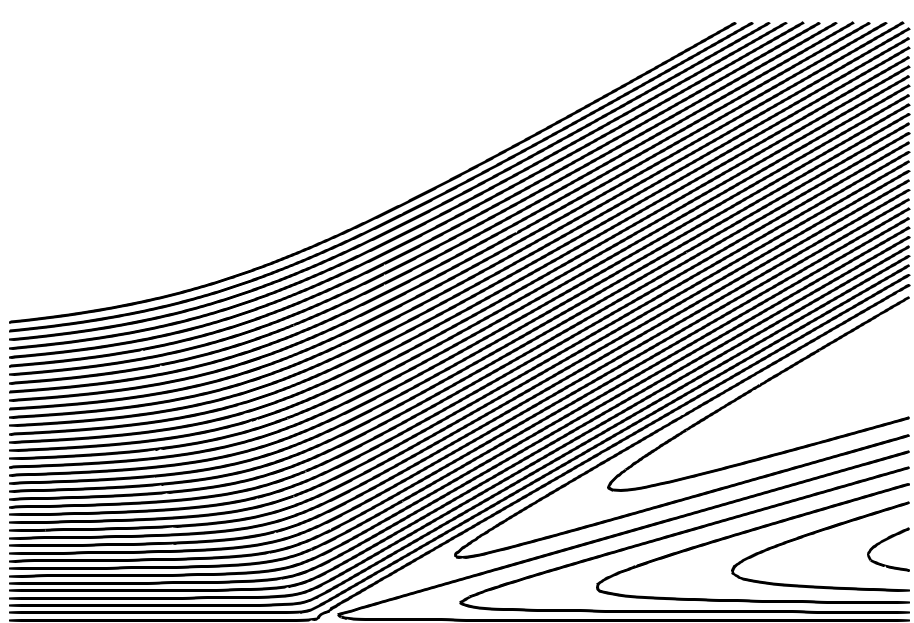
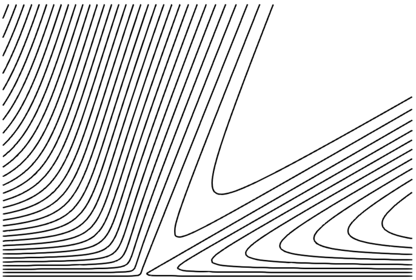

# Introduction

Reproducing [HuhScriven].

# Install

    make

# Usage

Write a legacy vtk file with velocity (vx, vy), pressure, and a stream
function (psi) for viscosity ratio 400 and an interface inclination
angle 30 degree.

    ./grid -r 400 -p 30 > out.vtk

# Results

R = 400, phi = 30

R = 1, phi = 30

# References

- [HuhScriven] Huh, C., & Scriven, L. E. (1971). Hydrodynamic model of
  steady movement of a solid/liquid/fluid contact line. Journal of
  colloid and interface science, 35(1), 85-101.
